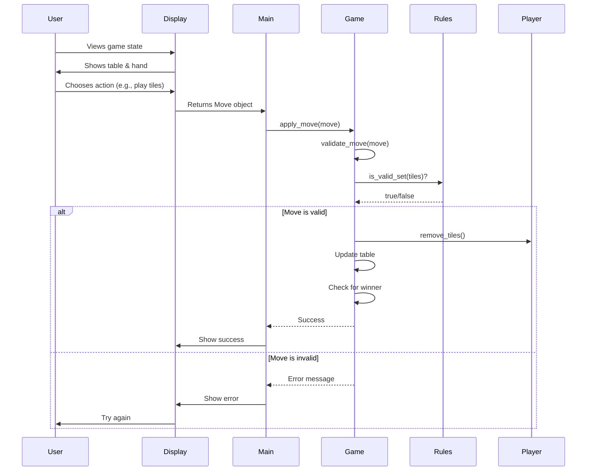

# Game Flow - Following a Turn

Let's trace through exactly what happens when you take a turn in Rummikub. We'll follow the code step by step!

## Visual Overview

Here's a sequence diagram showing how different parts of the game interact during a turn:



## The Journey of a Turn 🎮

When it's your turn, here's what happens behind the scenes:

### 1. Display Shows Game State 📺

```python
# In main.py - run_game()
self.interface.show_game_state(self.game_state)
```

This calls display.py which:
1. Clears the screen
2. Shows tiles on the table
3. Shows your tiles
4. Displays the menu

### 2. Getting Your Choice 🤔

```python
# In display.py - get_human_move()
print("\nYour Options:")
print("1. Sort tiles by color")
print("2. Sort tiles by number") 
print("3. Play new meld")
print("4. Draw a tile")

choice = input("\nEnter your choice (1-4): ")
```

The game waits for you to type a number.

### 3. Processing Your Choice 🔄

Let's say you choose "3" (Play new meld). Here's what happens:

#### Step 3a: Select Tiles
```python
# In display.py
selected_tiles = self.get_tile_selection(player)
```

You'll see:
```
Select tiles to play (enter numbers separated by spaces, 0 to cancel):
Your tiles:
1. [5 red]    2. [5 blue]    3. [5 black]
> 1 2 3
```

#### Step 3b: Create a Move Object
```python
# In display.py
move = Move(
    player_id=player_id,
    move_type=MoveType.PLAY_NEW_MELD,
    tiles=selected_tiles
)
```

This packages your choice into a structured format.

### 4. Validating Your Move ✅

```python
# In game.py - validate_move()
def validate_move(self, move: Move) -> Tuple[bool, Optional[str]]:
    # Check 1: Is it your turn?
    if move.player_id != self.current_player_index:
        return False, "Not your turn"
    
    # Check 2: Do you have these tiles?
    if not player.has_tiles(move.tiles):
        return False, "You don't have those tiles"
    
    # Check 3: Do they form a valid set?
    if not is_valid_set(move.tiles):
        return False, "Tiles don't form a valid set"
    
    # Check 4: Initial meld rule
    if not player.has_melded:
        if not is_initial_meld_valid(move.tiles):
            return False, "Initial meld must be 30+ points"
```

Each check happens in order. If any fails, the move is rejected.

### 5. Applying Your Move 🎯

If validation passes:

```python
# In game.py - apply_move()
# Remove tiles from your hand
player.remove_tiles(move.tiles)

# Add them to the table
self.table_sets.append(move.tiles.copy())

# Mark that you've melded (if first time)
if not player.has_melded:
    player.has_melded = True
```

### 6. Checking for Winner 🏆

```python
# Still in apply_move()
if is_winning_state(player.tiles):
    self.winner = player
    self.phase = GamePhase.FINISHED
```

If you played your last tile, you win!

### 7. Next Player's Turn ⏭️

```python
# If not a draw move
if move.move_type != MoveType.DRAW:
    self.next_turn()
```

The current player index advances.

## Complete Turn Flow Diagram 📊

```
START TURN
    ↓
Show Current State → display.py: show_game_state()
    ↓
Get Player Input → display.py: get_human_move()
    ↓
Create Move Object → Move(player_id, move_type, tiles)
    ↓
Validate Move → game.py: validate_move()
    ↓
    ├─ Invalid → Show Error → Try Again
    ↓
    └─ Valid → Apply Move → game.py: apply_move()
                   ↓
              Update State
                   ↓
              Check Winner
                   ↓
                   ├─ Yes → END GAME
                   ↓
                   └─ No → Next Turn → REPEAT
```

## Let's Trace a Specific Example 🔍

**Scenario**: Alice wants to play [10 red] [10 blue] [10 black] as her first meld.

### 1. Display Phase
```python
# display.py shows:
"""
=======================================
           Table Sets
=======================================
(No sets on table yet)

Alice's tiles:
1. [3 red]    5. [10 red]    9. [12 blue]
2. [5 blue]   6. [10 blue]   10. [13 red]
3. [7 black]  7. [10 black]  11. [13 blue]
4. [8 red]    8. [11 red]    12. [13 black]
"""
```

### 2. Input Phase
```python
# Alice chooses option 3 (Play new meld)
# Then selects tiles 5, 6, 7
selected_indices = [5, 6, 7]  # (actually 4, 5, 6 in code - 0-indexed!)
selected_tiles = [tiles[4], tiles[5], tiles[6]]
```

### 3. Validation Phase
```python
# validate_move() checks:
move.player_id == 0  # ✓ Alice is player 0
player.has_tiles([10r, 10b, 10k])  # ✓ She has them
is_valid_set([10r, 10b, 10k])  # ✓ Valid group
is_initial_meld_valid([10r, 10b, 10k])  # ✓ 30 points
```

### 4. Application Phase
```python
# apply_move() executes:
player.tiles.remove(Tile(10, 'red'))
player.tiles.remove(Tile(10, 'blue'))
player.tiles.remove(Tile(10, 'black'))
table_sets.append([Tile(10, 'red'), Tile(10, 'blue'), Tile(10, 'black')])
player.has_melded = True
```

### 5. State After Turn
- Alice now has 11 tiles (started with 14, played 3)
- Table shows one set: [10 red] [10 blue] [10 black]
- Alice's `has_melded` flag is True
- It's now Bob's turn

## Special Cases 🎯

### Drawing a Tile
```python
if move.move_type == MoveType.DRAW:
    drawn_tile = self.draw_pile.draw_tile()
    player.add_tile(drawn_tile)
    # Turn advances to next player
```

### Rearranging Table
```python
if move.move_type == MoveType.REARRANGE_TABLE:
    # Validate entire new arrangement
    is_valid, error = validate_table_state(move.new_table_arrangement)
    
    # If valid, replace entire table
    self.table_sets = move.new_table_arrangement
```

### Invalid Move
```python
success, error = game.apply_move(move)
if not success:
    display.show_error(error)  # "Tiles don't form a valid set"
    # Player tries again - turn doesn't advance
```

## Error Handling Flow 🛡️

When something goes wrong:

1. **Validation Fails**
   ```python
   is_valid, error = validate_move(move)
   # error = "Initial meld must be 30+ points"
   ```

2. **Display Error**
   ```python
   print(f"\n❌ Invalid move: {error}")
   ```

3. **Return to Menu**
   - Player sees the error
   - Game state unchanged
   - Same player tries again

## The Beauty of the Design 🌟

Notice how:
- **Each layer has one job**: Display shows, Game manages, Rules validate
- **State is protected**: Invalid moves can't corrupt the game
- **Errors are helpful**: Players know exactly what went wrong
- **Flow is clear**: Each step leads logically to the next

## Performance Considerations ⚡

The code is optimized for clarity, but still efficient:
- Validation happens before any changes
- Lists are copied when needed to prevent accidents
- Early returns avoid unnecessary work

---

## What You've Learned

You now understand:
- 📺 How the display system works
- 🎮 How player input becomes game actions  
- ✅ How moves are validated
- 🔄 How game state updates
- 🏆 How winners are detected

## Next Steps

Ready to make your own changes?
- ✏️ Start with [Simple Modifications](../making-changes/simple-modifications.md)
- 🔧 Then try [Adding Features](../making-changes/adding-features.md)
- 🧪 Don't forget to [Test Your Changes](../making-changes/testing-changes.md)

Remember: Following the flow helps you understand where to make changes!