# How Rules Become Code

Let's see how Rummikub rules are translated into Python code. This is where the magic happens - turning game rules into instructions a computer can follow!

## From Rules to Code 🔄

### Rule: "A group has 3-4 tiles with the same number but different colors"

Here's how this becomes code in `rules.py`:

```python
def is_valid_group(tiles: List[Tile]) -> bool:
    """Check if tiles form a valid group."""
    
    # Rule: Must have 3 or 4 tiles
    if len(tiles) < 3 or len(tiles) > 4:
        return False
    
    # Rule: All tiles must have the same number
    numbers = [tile.number for tile in tiles]
    if len(set(numbers)) != 1:
        return False
    
    # Rule: All tiles must have different colors
    colors = [tile.color for tile in tiles]
    if len(colors) != len(set(colors)):
        return False
    
    return True
```

Let's break this down:

1. **Check tile count**: `len(tiles) < 3 or len(tiles) > 4`
   - `len()` counts items
   - Must be exactly 3 or 4 tiles

2. **Check same number**: `len(set(numbers)) != 1`
   - Get all the numbers into a list
   - `set()` removes duplicates
   - If all numbers are the same, the set will have 1 item

3. **Check different colors**: `len(colors) != len(set(colors))`
   - If any colors repeat, the set will be smaller than the list
   - This clever trick detects duplicates!

## The 30-Point Initial Meld 💯

### Rule: "Your first play must be worth at least 30 points"

```python
def is_initial_meld_valid(tiles: List[Tile]) -> bool:
    """Check if tiles meet the 30-point requirement."""
    MIN_INITIAL_MELD_VALUE = 30
    
    total_value = 0
    for tile in tiles:
        if tile.is_joker():
            # Joker worth depends on context
            # Count as 0 for now (conservative)
            continue
        else:
            total_value += tile.number
    
    return total_value >= MIN_INITIAL_MELD_VALUE
```

The code:
1. Sets the minimum (30 points)
2. Adds up each tile's value
3. Handles jokers specially
4. Checks if total meets minimum

## Validating Runs 🏃

### Rule: "A run has 3+ consecutive numbers in the same color"

```python
def is_valid_run(tiles: List[Tile]) -> bool:
    """Check if tiles form a valid run."""
    
    # Need at least 3 tiles
    if len(tiles) < 3:
        return False
    
    # All must be the same color (except jokers)
    colors = [tile.color for tile in tiles if not tile.is_joker()]
    if len(set(colors)) > 1:
        return False
    
    # The actual implementation handles jokers by:
    # 1. Checking if jokers can fill gaps between numbers
    # 2. Allowing jokers to extend the sequence at either end
    # 3. Ensuring the full sequence stays within 1-13
    
    # For example, these are all valid runs:
    # [5 red] [Joker] [7 red] - joker fills gap as 6
    # [Joker] [2 blue] [3 blue] - joker extends as 1 or 4
    # [11 black] [12 black] [Joker] - joker extends as 10 or 13
    
    return True  # (simplified - see rules.py for full logic)
```

This code:
1. Checks minimum length (3+ tiles)
2. Verifies all non-joker tiles are same color
3. Validates jokers can form a consecutive sequence
4. Ensures all numbers stay within valid range (1-13)

## The Tile Object 🎨

### Rule: "Tiles have a number (1-13) and a color"

```python
@dataclass
class Tile:
    number: int  # 0 for joker, 1-13 for regular
    color: str   # 'red', 'blue', 'black', 'orange', or 'joker'
    
    def __post_init__(self):
        """Validate tile after creation."""
        if self.color == 'joker':
            if self.number != 0:
                raise ValueError("Joker must have number 0")
        else:
            if self.number < 1 or self.number > 13:
                raise ValueError(f"Invalid number: {self.number}")
```

The `@dataclass` decorator is Python magic that:
- Automatically creates initialization code
- Makes tiles easy to create: `Tile(5, 'red')`
- Handles equality comparisons

## Managing Game State 🎮

### Rule: "Players take turns until someone wins"

Here's how the game progresses through different phases:


```python
class GameState:
    def __init__(self, player_names):
        self.players = [Player(i, name) for i, name in enumerate(player_names)]
        self.current_player_index = 0
        self.phase = GamePhase.NOT_STARTED
        
    def next_turn(self):
        """Move to next player."""
        self.current_player_index = (self.current_player_index + 1) % len(self.players)
        
    def get_current_player(self):
        """Get whose turn it is."""
        return self.players[self.current_player_index]
```

The `%` operator creates a cycle:
- With 3 players: 0 → 1 → 2 → 0 → 1 → 2...
- Automatically wraps around!

## Validating Moves 🛡️

### Rule: "You can only play valid sets"

Here's the validation flow when a player tries to make a move:

```mermaid
flowchart TD
    A[Player Makes Move] --> B{Right Player's Turn?}
    B -->|No| C[Return: Not your turn]
    B -->|Yes| D{Has These Tiles?}
    D -->|No| E[Return: You don't have those tiles]
    D -->|Yes| F{Move Type?}
    
    F -->|DRAW| G[Can Draw?]
    G -->|Yes| H[✓ Valid Move]
    G -->|No| I[Return: Draw pile empty]
    
    F -->|PLAY_NEW_MELD| J{Valid Set?}
    J -->|No| K[Return: Invalid set]
    J -->|Yes| L{Has Melded Before?}
    L -->|Yes| H
    L -->|No| M{30+ Points?}
    M -->|Yes| H
    M -->|No| N[Return: Need 30+ points]
    
    F -->|ADD_TO_EXISTING| O{Has Melded?}
    O -->|No| P[Return: Must meld first]
    O -->|Yes| Q{Valid After Adding?}
    Q -->|Yes| H
    Q -->|No| R[Return: Would break set]
    
    style H fill:#66BB6A,stroke:#2E7D32,stroke-width:2px,color:#fff
    style C fill:#EF5350,stroke:#C62828,stroke-width:2px,color:#fff
    style E fill:#EF5350,stroke:#C62828,stroke-width:2px,color:#fff
    style I fill:#EF5350,stroke:#C62828,stroke-width:2px,color:#fff
    style K fill:#EF5350,stroke:#C62828,stroke-width:2px,color:#fff
    style N fill:#EF5350,stroke:#C62828,stroke-width:2px,color:#fff
    style P fill:#EF5350,stroke:#C62828,stroke-width:2px,color:#fff
    style R fill:#EF5350,stroke:#C62828,stroke-width:2px,color:#fff
```



```python
def validate_move(self, move: Move) -> Tuple[bool, Optional[str]]:
    """Check if a move is legal."""
    
    # Is it the right player's turn?
    if move.player_id != self.current_player_index:
        return False, "Not your turn"
    
    # Do they have the tiles they're trying to play?
    player = self.players[move.player_id]
    if not player.has_tiles(move.tiles):
        return False, "You don't have those tiles"
    
    # Are the tiles a valid set?
    if not is_valid_set(move.tiles):
        return False, "Tiles don't form a valid set"
    
    # Check initial meld if needed
    if not player.has_melded:
        if not is_initial_meld_valid(move.tiles):
            return False, "Initial meld must be 30+ points"
    
    return True, None
```

Notice how each game rule becomes a code check:
- Right player? ✓
- Has tiles? ✓
- Valid set? ✓
- Meets initial meld? ✓

## Winning Condition 🏆

### Rule: "First player with no tiles wins"

```python
def is_winning_state(tiles: List[Tile]) -> bool:
    """Check if a player has won."""
    return len(tiles) == 0

# In game.py:
if is_winning_state(player.tiles):
    self.winner = player
    self.phase = GamePhase.FINISHED
```

Simple but effective - empty hand = winner!

## Design Patterns in Our Code 🏗️

### 1. Separation of Concerns
- `rules.py` only validates - never changes anything
- `game.py` manages state - uses rules to check validity
- `display.py` only shows - never makes game decisions

### 2. Single Responsibility
Each function does one thing:
- `is_valid_group()` - only checks groups
- `is_valid_run()` - only checks runs
- `is_valid_set()` - combines both checks

### 3. Fail Fast
```python
if len(tiles) < 3:
    return False  # Stop immediately
    
# More expensive checks come later
```

### 4. Clear Naming
Function names tell you what they do:
- `is_valid_group()` - Returns True/False about groups
- `calculate_tile_value()` - Computes and returns a value
- `can_player_meld()` - Checks if something is possible

## The Beauty of Rule Translation 🌟

Look how natural the code reads:
```python
if player.has_melded and is_valid_set(tiles):
    table_sets.append(tiles)
    player.remove_tiles(tiles)
```

Almost like English: "If player has melded and tiles form valid set, add tiles to table and remove from player."

## Key Insights 💡

1. **Rules become conditions**: Each game rule becomes an `if` statement
2. **State tracks progress**: Variables remember what's happened
3. **Validation protects**: Check everything before changing anything
4. **Functions organize**: Each rule gets its own function
5. **Clear code explains itself**: Good names make code readable

---

## Next Steps

Now you've seen how rules become code:
- 🔄 Follow a complete turn in [Game Flow](game-flow.md)
- ✏️ Try [making changes](../making-changes/simple-modifications.md) yourself
- 📚 Review the [actual code files](../understanding-the-code/project-structure.md)

Remember: The best code reads like a description of what it does. Our Rummikub code tries to be that clear!