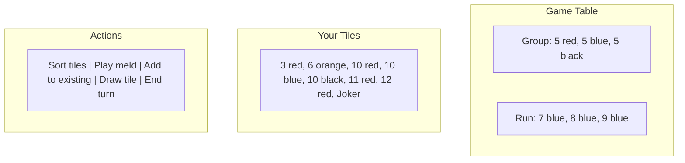

# Welcome to Educational Rummikub! 🎯

## What is This?

This is a computer version of the popular tile game Rummikub, written in a programming language called Python. It's designed to be a great example of how real software is built - clear, organized, and understandable.

If you've never written code before, that's perfectly fine! This documentation will guide you through everything step by step.

## What Does It Look Like?

Here's a simplified view of what you'll see when playing:



The game tracks everything: whose turn it is, what's on the table, and whether moves are valid!

## What Can You Do Here?

### 🎮 Just Want to Play?
If you want to play Rummikub on your computer:
- Go to [Getting Started](getting-started/installation.md) to install what you need
- Then check [Running the Game](getting-started/running-the-game.md) to start playing

### 📖 Want to Understand How It Works?
Curious about how a computer game is built? Start with:
- [Understanding the Code Overview](understanding-the-code/overview.md) - See the big picture
- [Reading Python](understanding-the-code/reading-python.md) - Learn to read the code

### 🔧 Want to Change Things?
Ready to make your own modifications? Check out:
- [Simple Modifications](making-changes/simple-modifications.md) - Change colors, messages, and more
- [Testing Your Changes](making-changes/testing-changes.md) - Make sure everything still works

## How This Documentation Works

We've organized everything to help you learn at your own pace:

1. **Getting Started** - Get the game running on your computer
2. **Understanding the Code** - Learn how the pieces fit together
3. **Game Mechanics** - See how Rummikub rules become computer code
4. **Making Changes** - Modify the game yourself
5. **Reference** - Quick lookups and definitions

## A Few Helpful Tips

- 💡 **You don't need to understand everything at once** - Start with what interests you
- 🔍 **Blue text links to other pages** - Click them to learn more
- 📝 **"Try This" boxes show hands-on examples** - Follow along on your computer
- ❓ **Stuck? Check [Troubleshooting](getting-started/troubleshooting.md)** - Common problems and solutions

## What is Python?

Python is a programming language - a way to give instructions to a computer. It's known for being friendly to beginners because it looks a lot like regular English. For example, here's a line from our game:

```python
if player.has_melded:
    print("You can add tiles to the table!")
```

Even without knowing Python, you can probably guess what this does - if the player has melded (played their first tiles), it shows them a message!

## Ready to Start?

Choose your path:
- 🎮 [I want to play the game →](getting-started/installation.md)
- 📚 [I want to understand the code →](understanding-the-code/overview.md)
- 🛠️ [I want to make changes →](making-changes/simple-modifications.md)

Remember: everyone starts as a beginner. Take your time, try things out, and have fun exploring!