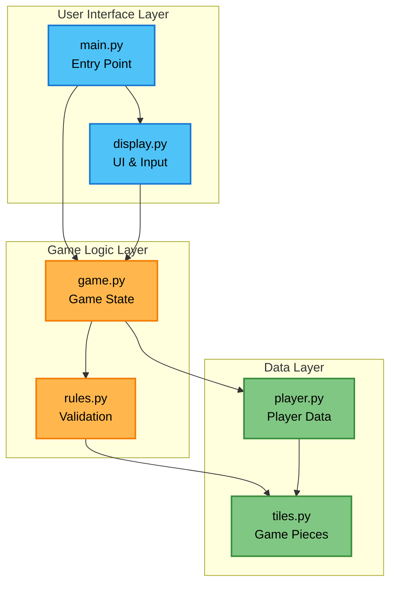

# Understanding the Code - Overview

Let's explore how Educational Rummikub is built! Don't worry if you've never looked at code before - we'll take it step by step.

## Think of It Like a Restaurant 🍽️

To understand how this game works, imagine a restaurant:

- **The Kitchen** (`tiles.py`, `rules.py`) - Where the basic ingredients are prepared
- **The Manager's Office** (`game.py`) - Where all the business logic happens
- **The Waitstaff** (`display.py`) - Who interact with customers
- **The Dining Room** (`player.py`) - Where customers sit
- **The Front Door** (`main.py`) - Where customers enter

Each part has a specific job, and they work together to create the experience!

## System Architecture

Here's how the components connect and interact:



The diagram shows three layers:
- **User Interface** (blue): Where players interact with the game
- **Game Logic** (orange): Where game rules and state are managed
- **Data Layer** (green): Where game data structures are defined

## The Files and What They Do

### 📦 `tiles.py` - The Game Pieces
**What it does**: Defines what tiles are and how to create a deck

Think of this as the "game piece factory." It knows:
- What a tile looks like (number + color)
- How to create a full deck of 106 tiles
- How to shuffle and deal tiles

**Key concept**: This file creates the building blocks everything else uses.

### 📋 `rules.py` - The Rule Book
**What it does**: Checks if moves are legal

Like a referee, this file answers questions:
- "Is this a valid group?" (like [5 red] [5 blue] [5 black])
- "Is this a valid run?" (like [7 blue] [8 blue] [9 blue])
- "Does this initial meld have enough points?"

**Key concept**: This file never changes the game - it just says "yes" or "no" to moves.

### 🎮 `game.py` - The Game Manager
**What it does**: Keeps track of everything happening in the game

This is the "brain" that:
- Knows whose turn it is
- Tracks what's on the table
- Applies moves when players make them
- Declares winners

**Key concept**: This file manages the game state (what's happening right now).

### 👤 `player.py` - The Players
**What it does**: Represents each person playing

Simple but important - tracks:
- Player's name
- Their tiles
- Whether they've made their initial meld

**Key concept**: This file is about data storage, not decision-making (humans make the decisions).

### 🖥️ `display.py` - The Screen
**What it does**: Shows the game to players and gets their input

This file handles:
- Printing the table and tiles nicely
- Showing menus
- Getting player choices
- Making things colorful

**Key concept**: This is the only file that talks to the player directly.

### 🚪 `main.py` - The Entry Point
**What it does**: Starts everything up

When you run `python main.py`, this file:
- Shows the main menu
- Sets up new games
- Connects all the other pieces

**Key concept**: This is where the program begins.

## How They Work Together

Here's what happens when you play a tile:

```
1. display.py shows you the menu and gets your choice
   ↓
2. main.py receives your choice and asks game.py to handle it
   ↓
3. game.py checks with rules.py: "Is this move legal?"
   ↓
4. rules.py examines the tiles and says "yes" or "no"
   ↓
5. If yes, game.py updates the game state
   ↓
6. display.py shows you the updated table
```

## Reading Your First Code

Let's look at a real example from `player.py`:

```python
def add_tile(self, tile: Tile) -> None:
    """Add a single tile to the player's hand."""
    self.tiles.append(tile)
```

Let's break this down:
- `def` means "define a new function" (a set of instructions)
- `add_tile` is the name we're giving these instructions
- `self` refers to the player we're working with
- `tile: Tile` means we expect to receive a tile
- `self.tiles.append(tile)` adds the tile to the player's collection

In plain English: "Here's how to add a tile to a player's hand: take their list of tiles and add the new tile to it."

## Patterns You'll See

As you explore the code, you'll notice patterns:

### 1. **Functions** - Reusable Instructions
```python
def do_something():
    # Instructions here
```

### 2. **Classes** - Blueprints for Objects
```python
class Player:
    # What a player has and can do
```

### 3. **If Statements** - Making Decisions
```python
if player.has_melded:
    # Do this
else:
    # Do that
```

### 4. **Lists** - Collections of Things
```python
tiles = [tile1, tile2, tile3]
```

## Where to Go Next

Now that you have the big picture:

1. **Want to read Python?** → [Reading Python](reading-python.md)
2. **Want details on each file?** → [Project Structure](project-structure.md)
3. **Want to understand programming concepts?** → [Key Concepts](key-concepts.md)
4. **Ready to see how rules work?** → [Game Mechanics](../game-mechanics/rules.md)

## Remember

- 🔍 **You don't need to understand everything at once**
- 📚 **Each file has one main job**
- 🧩 **The files work together like puzzle pieces**
- 💡 **The code is just instructions written in a special language**

Take your time, and don't hesitate to jump between files to see how they connect!