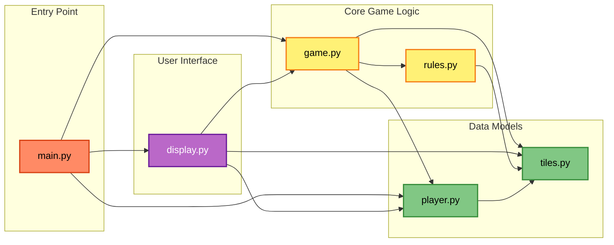

# Project Structure - Detailed Guide

Let's explore each file in detail. We'll look at what each file does, its main parts, and how to navigate it.

## File Overview

```
educational-rummikub/
├── main.py          # 273 lines - Entry point and menus
├── tiles.py         # 179 lines - Tile and deck definitions
├── rules.py         # 246 lines - Game rule validation
├── game.py          # 394 lines - Game state management
├── player.py        # 180 lines - Player class
├── display.py       # 406 lines - User interface
└── tests/           # Test files to verify code works
    ├── test_tiles.py
    ├── test_rules.py
    ├── test_game.py
    ├── test_player.py
    └── test_display.py
```

## 📦 tiles.py - The Foundation

**Purpose**: Defines what tiles are and manages collections of tiles.

### Main Components:

#### 1. Constants (Settings)
```python
TILE_COLORS = ['red', 'blue', 'black', 'orange']
JOKER_COLOR = 'joker'
MIN_TILE_NUMBER = 1
MAX_TILE_NUMBER = 13
```
These are like the "rules of the universe" for tiles - they never change.

#### 2. The Tile Class
```python
@dataclass
class Tile:
    number: int  # 0 for joker, 1-13 for regular tiles
    color: str   # 'red', 'blue', 'black', 'orange', or 'joker'
```

This is the blueprint for every tile in the game. The `@dataclass` is Python magic that makes tiles easier to create.

#### 3. The Deck Class
Manages collections of tiles (like the draw pile):
- `shuffle()` - Mixes up the tiles randomly
- `draw_tile()` - Takes one tile from the top
- `draw_tiles(count)` - Takes multiple tiles

#### 4. Helper Functions
- `create_tile(number, color)` - Makes a single tile
- `create_joker()` - Makes a joker tile
- `create_standard_deck()` - Creates all 106 tiles for a game

### How to Navigate This File:
1. Start at the top with constants
2. Read the Tile class to understand individual tiles
3. Read the Deck class to see how groups of tiles work
4. Check the helper functions at the bottom

---

## 📋 rules.py - The Rule Enforcer

**Purpose**: Contains all the logic for validating moves according to Rummikub rules.

### Main Components:

#### 1. Basic Validators
```python
def is_valid_group(tiles)  # Same number, different colors
def is_valid_run(tiles)    # Consecutive numbers, same color
def is_valid_set(tiles)    # Either a group OR a run
```

These are the core rules of what makes a valid play.

#### 2. Special Rule Checkers
- `is_initial_meld_valid(tiles)` - Checks if first play is worth 30+ points
- `can_add_to_set(existing_set, new_tiles)` - Can you add tiles to what's on the table?

#### 3. Complex Validators
- `validate_table_state(table_sets)` - Is the entire table valid?
- `can_rearrange_table(...)` - Can you move tiles around?

### Understanding the Flow:
Most functions follow this pattern:
1. Check basic requirements (like minimum tiles)
2. Apply specific rules
3. Return True (valid) or False (invalid)

### Key Insight:
This file never changes anything - it just looks and says "yes" or "no". It's like a referee who knows all the rules but doesn't touch the ball.

---

## 🎮 game.py - The Game Engine

**Purpose**: Manages everything happening in the game - the "brain" of the operation.

### Main Classes:

#### 1. GamePhase (Game States)
```python
class GamePhase(Enum):
    NOT_STARTED = "not_started"
    IN_PROGRESS = "in_progress"
    FINISHED = "finished"
```

#### 2. MoveType (What Players Can Do)
```python
class MoveType(Enum):
    DRAW = "draw"
    PLAY_NEW_MELD = "play_new_meld"
    ADD_TO_EXISTING = "add_to_existing"
    END_TURN = "end_turn"
```

#### 3. GameState (The Main Controller)
This is the biggest and most important class. It tracks:
- All players
- Whose turn it is
- What's on the table
- The draw pile
- Who has won

Key methods:
- `start_game()` - Sets everything up
- `validate_move(move)` - Checks if a move is legal
- `apply_move(move)` - Actually makes the move happen
- `get_game_status()` - Returns current game information

### How Moves Work:
1. Player makes a choice
2. `validate_move()` checks with rules.py
3. If valid, `apply_move()` updates the game
4. Game checks for winners
5. Next player's turn

---

## 👤 player.py - Player Information

**Purpose**: Simple class that stores information about each player.

### What It Tracks:
- `player_id` - Unique number for each player
- `name` - Player's display name
- `tiles` - List of tiles in hand
- `has_melded` - Whether they've made their 30-point play

### Key Methods:
- `add_tile(tile)` - Give player a tile
- `remove_tile(tile)` - Take a tile from player
- `has_tiles(tiles)` - Check if player has specific tiles
- `get_hand_value()` - Calculate total points in hand
- `sort_tiles()` - Organize tiles by color or number

### Why So Simple?
This file just stores data. All the thinking and decision-making happens elsewhere (in the human player's brain!).

---

## 🖥️ display.py - The User Interface

**Purpose**: Everything related to showing the game and getting player input.

### Two Main Classes:

#### 1. Display Class
Handles output (showing things):
- `clear_screen()` - Cleans the display
- `display_tiles()` - Shows tiles with colors
- `display_table()` - Shows what's on the table
- `display_player_hand()` - Shows a player's tiles

#### 2. GameInterface Class
Handles input and game flow:
- `get_menu_choice()` - Shows menu, gets selection
- `get_tile_selection()` - Lets player pick tiles
- `get_human_move()` - Gets player's turn choice

### Special Features:
- ANSI color codes for colored output
- Automatic color detection
- Fallback for systems without color support

### The Flow:
1. Display shows current state
2. GameInterface asks what to do
3. Player makes choice
4. Display shows results

---

## 🚪 main.py - The Coordinator

**Purpose**: Ties everything together and provides the entry point.

### Main Components:

#### 1. RummikubGame Class
The master coordinator that:
- Shows the main menu
- Sets up games
- Runs the game loop
- Handles game endings

#### 2. Menu System
```python
def run_menu(self):
    # Shows main menu options
    # Routes to different game modes
```

#### 3. Command Line Parsing
```python
def parse_arguments():
    # Handles options like --players "Alice,Bob"
```

### The Journey:
1. User runs `python main.py`
2. Arguments are parsed
3. RummikubGame is created
4. Menu is shown (or game starts directly)
5. Game loop runs until someone wins
6. Results are displayed

---

## 🧪 tests/ - The Quality Checkers

**Purpose**: Automated tests that verify the code works correctly.

### Test Files Mirror Main Files:
- `test_tiles.py` → Tests tiles.py
- `test_rules.py` → Tests rules.py
- etc.

### What Tests Do:
```python
def test_valid_group(self):
    tiles = [
        create_tile(5, 'red'),
        create_tile(5, 'blue'),
        create_tile(5, 'black')
    ]
    self.assertTrue(is_valid_group(tiles))
```

This test checks that our `is_valid_group` function correctly identifies a valid group.

### Why Tests Matter:
- Catch bugs before players see them
- Make sure changes don't break existing features
- Document how code should behave
- Give confidence that everything works

---

## File Dependencies

Here's how files depend on each other through imports:



Key insights from the dependency graph:
- **tiles.py** is the foundation - it imports nothing from the game
- **rules.py** only depends on tiles - pure validation logic
- **game.py** is the central hub - it coordinates everything
- **main.py** ties the user interface to the game logic
- No circular dependencies - clean architecture!

---

## Putting It All Together

When you play a turn, here's the journey through the files:

1. **display.py** shows your tiles and asks what to do
2. **main.py** coordinates getting your choice
3. **game.py** validates your move (checking with **rules.py**)
4. **player.py** is updated (tiles added/removed)
5. **tiles.py** objects are moved around
6. **display.py** shows the new state

Each file has its job, and they work together like a well-organized team!

---

## Next Steps

Now that you know what each file does:
- 🔑 Learn about [Key Concepts](key-concepts.md) in programming
- 🎯 See [how rules are implemented](../game-mechanics/implementation.md)
- ✏️ Try [making simple changes](../making-changes/simple-modifications.md)

Remember: You don't need to memorize all this. Use this guide as a reference when exploring the code!